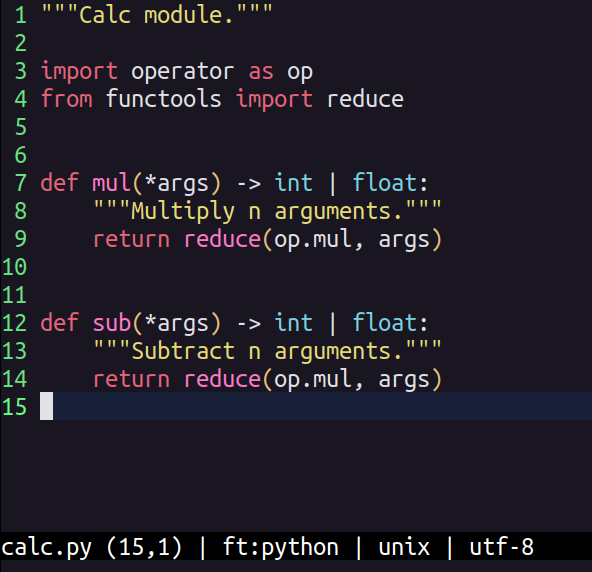

# Darken
Plugin with colorscheme of [micro](https://micro-editor.github.io/) editor.




## Installation

### Settings

Add this repo as a **pluginrepos** option in the `$XDG_CONFIG_HOME/micro/settings.json` file (it is necessary to restart the micro after this change):

```json title="~/.config/micro/settings.json"
  "pluginrepos": [
    "https://raw.githubusercontent.com/taconi/micro-darken/main/repo.json"
  ]
```

### Install

In your micro editor press **Ctrl-e** and run command:

```
> plugin install darken
```

*OR* Run in your shell

```shell
micro -plugin install darken
```